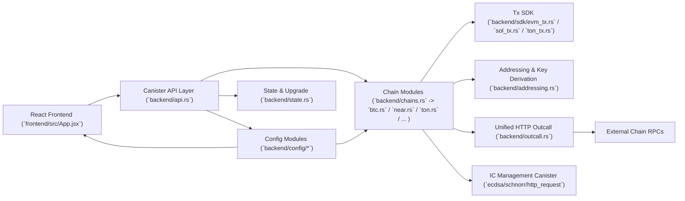

# canisterwalletforagent

一个用 Rust 编写的 ICP canister 钱包后端，面向 AI Agent 提供多链资产地址申请、余额查询与转账接口；前端为 React 控制台页面。

## 项目定位

- 本工程不负责 `controller` / `agent` 私钥生成与托管
- 本工程负责 canister 接口（Candid + Rust 实现），供 agent 按 `caller()` 调用
- 当前优先级是先把多链功能打通，鉴权策略后续再收紧（owner/agent/policy）

## 架构图（当前代码结构）



模块划分说明：

- `backend/api.rs`：只负责对外接口、参数校验入口、暂停/owner 占位逻辑
- `backend/chains.rs`：集中挂载“正在使用”的链模块，减少 `lib.rs` 直接依赖
- `backend/sdk/*`：交易编码/签名载荷构建等链协议细节（EVM / Solana / TON）
- `backend/outcall.rs`：统一 HTTP outcall 入口（所有外部 RPC 都从这里走）
- `backend/config/*`：RPC、token 列表、浏览器链接配置（前端与后端共用）
- `backend/addressing.rs`：管理 canister 公钥获取、地址编码、通用派生/格式化工具

## 功能概览（当前）

### 后端（Rust canister）

- `backend/api.rs`：所有 canister 对外接口集中定义
- `backend/{...}.rs`：按链拆分模块（EVM / BTC / ICP / Solana / TRON / TON / NEAR / Aptos / Sui）
- `backend/config/*`：RPC、Token 列表、区块浏览器配置（前端通过接口读取）
- `backend/outcall.rs`：统一封装外部 RPC 的 `http_request`
- `pre_upgrade` / `post_upgrade`：状态持久化
- `backend/backend.did`：Candid 接口导出

### 前端（React）

- 顶部显示 `Backend Canister ID`
- 网络选择（与后端 `supported_networks()` / `wallet_networks()` 对齐）
- 自动申请当前网络地址并自动查询主币余额（支持的链）
- Token 列表从后端 `configured_tokens(network)` 读取
- Token 虚拟列表（主币在第一个位置）
- 币种详情全屏界面（资产信息 + 发送表单）
- 区块浏览器按钮（浏览器链接从后端 `configured_explorer(network)` 读取）
- 详情界面打开时重新走链上余额查询（不是仅复用列表缓存）

## 网络命名（统一）

对外统一使用“网络名字”，不是主币符号，例如：

- `ethereum`
- `sepolia`
- `base`
- `bsc`
- `arbitrum`
- `optimism`
- `avalanche`
- `okx`
- `polygon`
- `internet-computer`
- `bitcoin`
- `solana`
- `solana-testnet`
- `tron`
- `ton-mainnet`
- `near-mainnet`
- `aptos-mainnet`
- `sui-mainnet`

说明：接口名仍保留历史前缀（例如 `eth_*`、`sol_*`），但请求/响应里的 `network` 与前端网络选择统一为上述网络名字。

## 地址申请（真实实现）

已实现真实地址申请（management canister 公钥，接口均为无参）：

- EVM 系（同地址组，均复用 `eth::request_address()`）：
  - `eth_request_address`
  - `sepolia_request_address`
  - `base_request_address`
  - `bsc_request_address`
  - `arb_request_address`
  - `op_request_address`
  - `avax_request_address`
  - `okb_request_address`
  - `polygon_request_address`
- 其他链：
  - `btc_request_address`（Taproot / `bc1...`）
  - `sol_request_address`
  - `solana_testnet_request_address`
  - `trx_request_address`
  - `ton_request_address`
  - `near_request_address`
  - `aptos_request_address`
  - `sui_request_address`
- `internet-computer`：前端直接使用后端 canister id / principal（不需要 `request_address`）

地址派生规则（当前）：

- 使用 management canister 公钥
- `canister_id = null`（当前后端 canister）
- `derivation_path = []`（不带任何派生参数）

## 地址共享关系（通过接口给 Agent）

`wallet_networks()` 返回以下字段，agent 不需要靠 README 猜规则：

- `address_family`
- `shared_address_group`

例如 EVM 系网络会返回同一个 `shared_address_group`（当前为 `evm-secp256k1-hex-v1`），表示这些网络地址字符串相同。

## 接口命名规则（显式）

- 余额：`<network_prefix>_get_balance_<asset_kind>`
- 转账：`<network_prefix>_transfer_<asset_kind>`

这样可以避免一个接口同时承担原生币与 token 资产的歧义。

## 已实现的“真实”链上功能

### EVM 系（真实余额 + 真实发送）

已实现原生币余额、ERC20 余额、原生币发送、ERC20 发送（RPC + canister 签名 + 广播）：

- `ethereum`
- `sepolia`
- `base`
- `bsc`
- `arbitrum`
- `optimism`
- `avalanche`
- `okx`
- `polygon`

实现方式（后端）：

- 余额：RPC `eth_getBalance` / `eth_call(balanceOf)`
- 发送：构造交易 -> `sign_with_ecdsa` -> `eth_sendRawTransaction`

### Bitcoin（真实余额 + 真实发送）

- `BTC` 主币余额（Esplora RPC）
- `BTC` 主币发送（UTXO 选币、Taproot key-path 签名、广播）

### Internet Computer（真实余额 + 真实发送）

- `ICP` 余额/发送（Ledger `icrc1_*`）
- `ICRC` Token 余额/发送（指定 token ledger canister）

### Solana / Solana Testnet（真实）

- `SOL` 主币余额（RPC `getBalance`）
- `SOL` 主币发送（`sign_with_schnorr(ed25519)` + `sendTransaction`）
- `SPL` Token 发送（`TransferChecked`，自动创建对方 ATA 后再发送）
- `SPL` Token 余额：当前仍未实现（接口已存在）

支持网络：

- `solana`
- `solana-testnet`

### TRON（真实余额 + 真实发送）

- `TRX` 主币余额/发送
- `TRC20` Token 余额/发送

### TON（真实余额 + 真实发送）

- `TON` 主币余额/发送（wallet v4r2）
- `Jetton` 余额/发送

### NEAR（真实余额 + 真实发送）

- `NEAR` 主币余额/发送
- `NEP-141` Token 余额/发送
- 隐式账户未初始化时，余额查询返回 `0`

### Aptos（真实余额 + 真实发送）

- `APT` 主币余额/发送
- `Token`（Coin Type）余额/发送

### Sui（真实余额 + 真实发送）

- `SUI` 主币余额/发送
- `Token`（Coin Type）余额/发送

## 未完成/限制（当前）

- `solana` / `solana-testnet` 的 `SPL` 余额查询仍未实现（发送已实现）
- 鉴权逻辑当前仍是 placeholder（后续会收紧到 owner/agent/policy）

## 重要后端配置接口（前端使用）

- `wallet_networks()`：网络列表与基础能力信息（主币符号、`address_family`、`shared_address_group`、能力位、默认 RPC）
- `configured_tokens(network)`：当前网络 token 列表
- `configured_explorer(network)`：区块浏览器 URL 模板（地址页 / token 页）

## 构建与部署

### 后端

```bash
cargo check -p backend
cargo build --target wasm32-unknown-unknown --release -p backend
```

更新 Candid：

```bash
candid-extractor target/wasm32-unknown-unknown/release/backend.wasm > backend/backend.did
```

### 前端

```bash
npm run build --prefix frontend
```

前端构建脚本会执行：

- `dfx generate backend`
- `vite build`

### 本地部署（示例）

```bash
dfx start --background --clean
dfx deploy backend
npm run build --prefix frontend
dfx deploy frontend
```

## 当前状态说明

- 多链地址申请、余额查询、发送接口已经统一到 `backend/api.rs`
- 外部 HTTP RPC 统一从 `backend/outcall.rs` 走，便于后续加重试/transform/审计
- 网络名统一使用 `types::networks::*` 常量
- EVM 系网络共享地址组信息通过 `wallet_networks()` 对外暴露（供 agent 直接消费）
